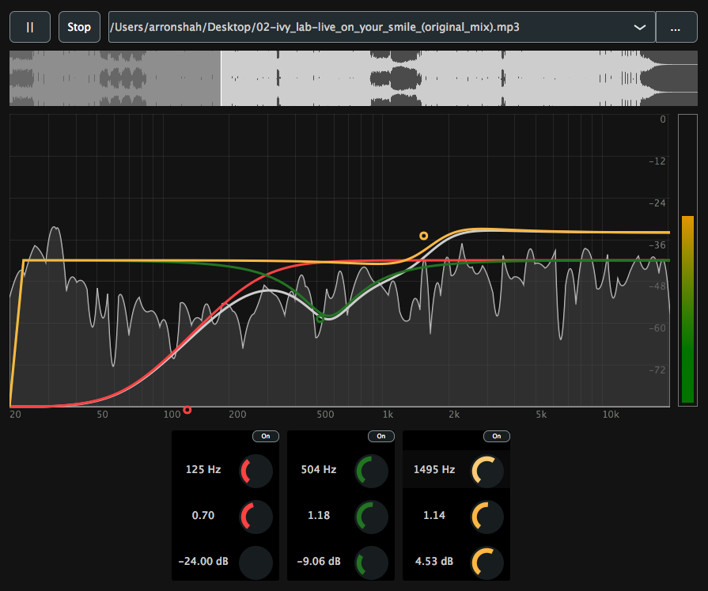

# Graphic EQ

This project is a standalone JUCE application containing an audio file player that is routed through a series of filters.
It contains a high shelf, peak and low shelf filter, each of which the user can control the frequency, resonance (Q-factor), and gain.
It also renderes a spectrum analyser of the output signal on to the GUI as well as each of the three filter response curves.

